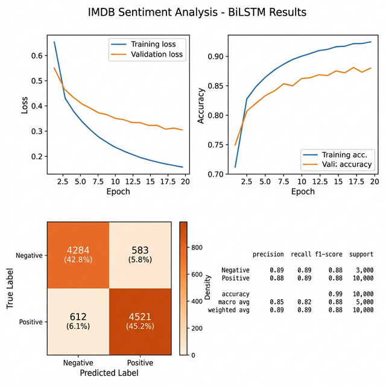

# Sentiment Analysis with Bidirectional LSTM

基于 **双向 LSTM（BiLSTM）** 的文本情绪分类系统。使用 PyTorch 从零实现完整的 NLP 流水线：文本预处理 → 词汇表构建 → 序列编码 → 模型训练 → 可视化评估。

## 项目目的

在 IMDB 电影评论数据集上实现二分类情感分析（正面/负面），不使用预训练词向量，完全从头构建 Embedding → BiLSTM → FC 分类模型。

## 核心功能

- **完整 NLP 流水线**：数据加载 → 文本预处理（小写转换、去标点、分词）→ 词汇表构建 → 数值编码 → 序列填充
- **自定义词汇表**：基于词频阈值（≥5）构建词汇表，支持 `<PAD>` 和 `<UNK>` 特殊标记
- **双向 LSTM 模型**：2 层 BiLSTM + Dropout 正则化 + 全连接分类层
- **训练策略**：Adam 优化器 + 学习率调度器（StepLR）+ 早停机制（patience=3）
- **可视化分析**：训练/验证损失曲线、准确率曲线、混淆矩阵热力图

## 技术架构

```
IMDB 电影评论文本
    ↓
文本预处理 (小写→去标点→分词)
    ↓
Vocabulary 词汇表 (freq_threshold=5)
    ↓
数值编码 + 序列填充 (max_len=200)
    ↓
Embedding (128维) → BiLSTM (256隐藏单元×2层)
    ↓
Dropout(0.5) → FC → Sigmoid
    ↓
输出: 正面(1) / 负面(0)
```

## 使用说明

### 数据集准备

下载 [IMDB Dataset](https://ai.stanford.edu/~amaas/data/sentiment/) 并解压到项目目录：

```
aclImdb/
├── train/
│   ├── pos/
│   └── neg/
└── test/
    ├── pos/
    └── neg/
```

### 环境安装

```bash
pip install torch torchvision torchaudio scikit-learn matplotlib seaborn
```

### 运行训练与评估

```bash
python main.py
```

#

### 训练结果



## 输出

- 每个 Epoch 的训练/验证损失和准确率
- 测试集分类报告（Precision/Recall/F1）
- 损失和准确率变化曲线图
- 混淆矩阵热力图

## 适用场景

- NLP 情感分析入门实践
- BiLSTM 文本分类实现参考
- 从零构建词汇表与编码系统
- 深度学习训练技巧（早停、学习率调度）

## 技术栈

| 组件 | 技术 |
|------|------|
| 深度学习框架 | PyTorch |
| 模型架构 | Bidirectional LSTM |
| 评估指标 | scikit-learn |
| 可视化 | Matplotlib, Seaborn |
| 数据集 | IMDB (Stanford AI Lab) |

## License

MIT License
